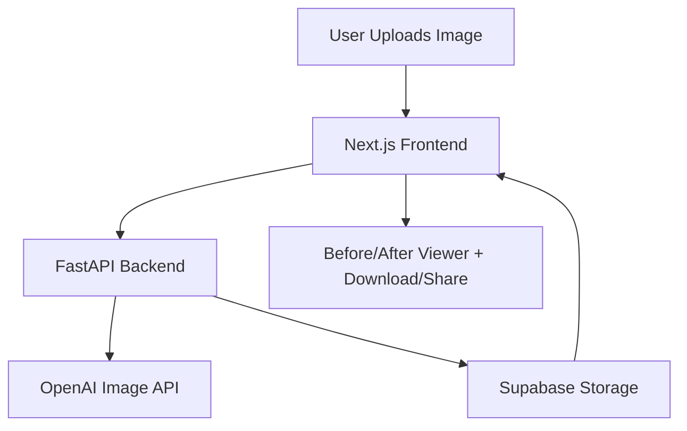

# GNB AI Look Generator

Delight pet parents by letting them upload a photo of their dog and instantly see a cozy, AI-generated makeover in Good Natured Brand (GNB) apparel. This full-stack app was built for the Flora AI Native Engineer Case Study.

---

## Live Demo
[(https://gnb-pet-style-ai.vercel.app/](https://gnb-pet-style-ai.vercel.app/)

---

## Tech Stack

### Frontend
- **Framework:** Next.js 14
- **Language:** TypeScript
- **Styling:** Tailwind CSS
- **Accessibility:** WCAG 2.1 AA color contrast
- **State & UX:** React Hooks, Responsive design (≤320px support)

### Backend
- **Framework:** FastAPI (Python)
- **Image Processing:** Base64 handling, overlay logic (PIL)
- **AI Integration:** OpenAI Image API

### Storage & Deployment
- **Storage:** Supabase (object storage for uploaded/generated images)
- **Deployment:** Vercel (Free Tier)

### Tooling
- **AI Dev Tools:** GitHub Copilot, Cursor, ChatGPT (prompt refinement), Claude ( UI refinement)
- **Testing:** Jest (frontend), Pytest (backend)
- **DevOps:** Environment variables, monorepo structure

---

## Setup Instructions

### Frontend (Next.js 14, TypeScript, Tailwind CSS)

cd frontend
npm install
npm run dev

python -m venv venv
source venv/bin/activate
pip install -r requirements.txt
uvicorn main:app --reload

### Backend (FastAPI)

python -m venv venv
source venv/bin/activate
pip install -r requirements.txt
uvicorn backend.main:app --reload --port 8000
---
## Architecture Diagram



---

## Prompt Snippets

This app uses structured, brand-aligned prompts to generate consistent AI images of dogs in cozy GNB outfits and themed environments.

### How Prompts Are Built

Each prompt is dynamically composed using two elements from a `prompts.json` file:

1. **Clothing** – e.g. `"wearing a hoodie with a green GNB logo"`
2. **Scenario** – e.g. `"sitting on a clean carpet in a bright, sunlit living room with green houseplants"`

The final prompt is constructed like this in Python:

```python
"Same dog {clothing}, {scenario}."
```

### prompts.json Format

```json
{
  "clothing": {
    "Hoodie": "wearing a hoodie with a green GNB logo",
    "T-shirt": "in cotton green GNB logo t-shirt",
    "Scarf": "wearing a cozy scarf with a soft texture and white GNB logo"
  },
  "scenario": {
    "Lemon Fresh Morning": "color of soft lemon, sitting on a clean carpet in a bright, sunlit living room with soft tones and green houseplants",
    "Orange Grove Adventure": "in orange color, standing in a grassy open field with soft light and distant trees"
  }
}
```

### Example Final Prompt

```
Same dog wearing a cozy scarf with a soft texture and white GNB logo, in orange color, standing in a grassy open field with soft light and distant trees.
```

---

## Future Work

### Multi-Shot Generation  
Generate 3 AI-styled variations in a single session, displayed as a “photoshoot” carousel.

### Smart Logo Placement  
Instead of a static corner overlay, dynamically place the GNB logo on clothing (e.g. scarf, hoodie) using object detection, masking or prompt control.

### Fun Themed Scenarios  
Introduce playful scenes such as:
- Dog cleaning the house with natural sprays  
- Dog relaxing in a freshly cleaned living room  
- Dog gardening or helping in an eco-friendly setting

### Shop This Product  
Link each generated image scenario back to a matching GNB product — creating a fun, shoppable bridge from imagination to store.

### Mobile Camera Integration  
Allow direct camera access on mobile for instant dog photo uploads, reducing friction and improving UX.

---
